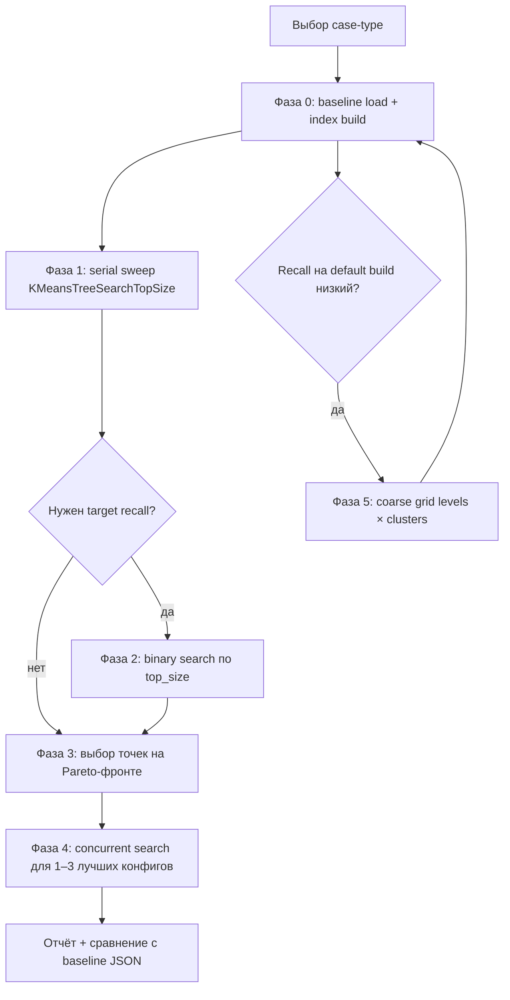

# Подбор параметров векторного индекса YDB для VectorDBBench

Документ описывает методологию подбора параметров `vector_kmeans_tree` в YDB для получения сопоставимых с публикациями VectorDBBench результатов (QPS + Recall@100).

## Контекст сравнения

VectorDBBench измеряет:

| Метрика | Как считается | Типичные значения лидеров (Cohere 1M, без фильтра) |
|---------|---------------|-----------------------------------------------------|
| **Recall@100** | Serial search по всем test-векторам, среднее попадание в GT top-100 | 0.88–0.95 |
| **QPS** | Max throughput при concurrency sweep `[1,5,10,20,30,40,60,80]`, 30 с на уровень | 3 000–10 000+ |
| **Serial latency p99** | Время одного запроса, serial pass | 1–3 ms |

Опубликованные baseline-результаты лежат в `vectordb_bench/results/` (Milvus, PgVector, Qdrant, Elastic и др.) с `task_label=standard_20260403`. Для честного сравнения нужны те же:

- **case-type** (`Performance768D1M`, `Performance1536D500K`, …)
- **k=100**
- **num-concurrency** по умолчанию
- **железо**: 8 vCPU / 32 GB RAM, сервер в той же зоне (см. README)

YDB использует **`vector_kmeans_tree`**, а не HNSW. Аналог `ef_search` у HNSW — **`KMeansTreeSearchTopSize`** (CLI: `--kmeans-tree-search-top-size`).

## Параметры индекса

### Поисковые (дешёвый перебор — не требуют пересборки индекса)

| Параметр | CLI | По умолчанию | Влияние |
|----------|-----|--------------|---------|
| `KMeansTreeSearchTopSize` | `--kmeans-tree-search-top-size` | 10 | Recall ↑, QPS ↓, latency ↑ |

Меняется через `PRAGMA ydb.KMeansTreeSearchTopSize` на каждый запрос. После первой загрузки данных и построения индекса можно запускать бенчмарк с `--skip-load --skip-drop-old`.

### Параметры построения (дорогой перебор — нужна пересборка индекса)

| Параметр | CLI | По умолчанию | Влияние |
|----------|-----|--------------|---------|
| `levels` | `--levels` | server default | Глубина дерева → качество / время build |
| `clusters` | `--clusters` | server default | Ветвление → recall / build time / память |
| `overlap_clusters` | `--overlap-clusters` | server default | Перекрытие кластеров → recall ↑, build/search cost ↑ |
| `cover_embedding` | `--cover-embedding` / `--no-cover-embedding` | true | COVER (embedding) → latency ↓, размер индекса ↑ |

Пересборка = полный цикл `--drop-old --load` (ADD INDEX после загрузки).

### Инфраструктурные (фиксируем для reproducibility)

- `--auto-partitioning-*` — одинаковые для всех прогонов одного case
- `--table-name` — явное имя, если нужно переиспользовать таблицу между экспериментами

## Рекомендуемая стратегия (разумное время)



### Фаза 0 — подготовка (1 прогон, ~часы для 1M)

```shell
vectordbbench ydb \
  --case-type Performance768D1M \
  --db-label ydb-tune-baseline \
  --load --search-serial --search-concurrent \
  --kmeans-tree-search-top-size 10
```

Зафиксируйте `levels`/`clusters`, если отличаетесь от server defaults.

### Фаза 1 — serial sweep search_top_size (~10–20 мин на case)

Без перезагрузки данных:

```shell
for n in 1 2 5 10 20 32 64; do
  vectordbbench ydb \
    --case-type Performance768D1M \
    --db-label "ydb-tune-top${n}" \
    --skip-drop-old --skip-load \
    --search-serial --skip-search-concurrent \
    --kmeans-tree-search-top-size "$n"
done
```

Строим кривую **Recall vs top_size**. Обычно recall монотонно растёт с top_size.

### Фаза 2 — binary search (опционально, ~5–15 мин)

Если нужен recall ≈ 0.92 (как у многих HNSW-конфигов с ef=100):

1. Найти `lo` (recall < target) и `hi` (recall ≥ target) из фазы 1.
2. Делить интервал пополам, serial search только.
3. Остановиться при `|recall - target| < 0.005` или ширине интервала ≤ 1.

### Фаза 3 — выбор конфигураций

Критерии для публикации на leaderboard:

1. **Recall-first**: recall ≥ 0.90 (или ≥ target), максимизировать QPS.
2. **Balanced**: максимизировать `QPS × recall` или точка на Pareto-фронте.
3. **Latency-first**: recall ≥ 0.88, минимальный serial p99.

Типичные опубликованные точки: recall 0.88–0.93 при QPS 3k–10k (зависит от СУБД и железа).

### Фаза 4 — финальный concurrent benchmark

Только для 1–3 отобранных `top_size`:

```shell
vectordbbench ydb \
  --case-type Performance768D1M \
  --db-label ydb-tune-final \
  --skip-drop-old --skip-load \
  --search-serial --search-concurrent \
  --kmeans-tree-search-top-size 20
```

### Фаза 5 — grid по build-параметрам (только если фаза 1 не даёт нужный recall)

Coarse grid (2–4 комбинации, не полный factorial):

| levels | clusters | overlap_clusters | Когда пробовать |
|--------|----------|------------------|-----------------|
| default | default | default | Всегда первым |
| 2 | 256 | — | Быстрый build, средний recall |
| 3 | 512 | 2 | Больше recall, дольше build |
| 3 | 1024 | 4 | Максимальное качество |

Каждая комбинация = полный load + index build. **Не смешивайте** build-параметры с `--skip-load`.

## Автоматизация

Скрипт `vectordbbench ydb-tune` реализует фазы 0–4:

```shell
pip install -e '.[ydb]'

export YDB_ENDPOINT=grpc://localhost:2136
export YDB_DATABASE=/Root/test

# Полный цикл с конфигом
vectordbbench ydb-tune --config-file ydb_tune_config.yml

# Только serial sweep (данные уже загружены)
vectordbbench ydb-tune \
  --case-type Performance768D1M \
  --skip-load --skip-drop-old \
  --phase search-sweep \
  --search-top-size-values 1,2,5,10,20,32,64 \
  --target-recall 0.92
```

Пример конфига: `vectordb_bench/config-files/ydb_tune_config.yml`.

Отчёт сохраняется в `output_dir` (JSON + CSV) с:

- таблицей всех прогонов (params → recall, qps, latency)
- рекомендованной конфигурацией
- сравнением с baseline из `vectordb_bench/results/`

## Чеклист перед публикацией результатов

- [ ] Тот же `case-type`, что у Milvus/PgVector в `standard_20260403`
- [ ] `k=100`, default concurrency
- [ ] Документированы YDB version, endpoint topology, CPU/RAM
- [ ] `db_label` отражает конфигурацию (например `ydb-kmeans-l3-c512-top20`)
- [ ] Recall и QPS из **одного** финального прогона с выбранными параметрами
- [ ] JSON результата в `vectordb_bench/results/YDB/` для UI

## Оценка времени (Performance768D1M, 8c32g)

| Этап | Время (ориентир) |
|------|------------------|
| Load + index build | 1–4 ч |
| Serial sweep (8 значений top_size) | 15–40 мин |
| Binary search (5 итераций) | 10–20 мин |
| Concurrent final (1–3 конфига) | 15–30 мин каждый |
| Build grid (3 варианта × load) | 3–12 ч |

**Практичный минимум**: фазы 0 + 1 + 4 для одного `top_size` ≈ load time + 1 ч.  
**Рекомендуемый**: автоматический `ydb-tune` с sweep + target recall 0.92 ≈ load time + 1–2 ч.

## Ссылки

- [YDB vector indexes](https://ydb.tech/docs/en/dev/vector-indexes)
- [VectorDBBench README](../README.md#run-ydb-from-command-line)
- Baseline results: `vectordb_bench/results/Milvus/result_20260403_standard_milvus.json`
